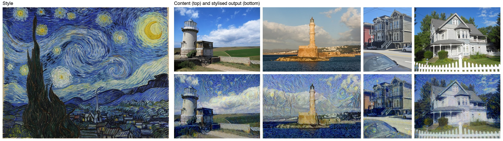
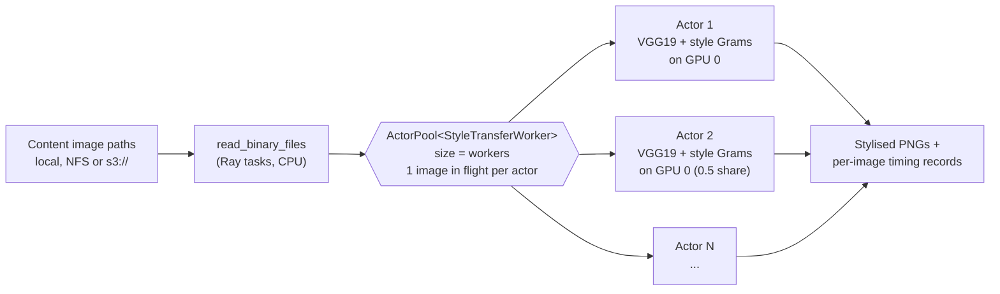

# Neural Style Transfer with PyTorch and Ray

[](https://github.com/morillo/neural-style-transfer/actions/workflows/ci.yml)


Batch neural style transfer ([Gatys et al., 2016](https://openaccess.thecvf.com/content_cvpr_2016/html/Gatys_Image_Style_Transfer_CVPR_2016_paper.html))
in PyTorch, spread across a pool of GPU (or CPU) workers with [Ray Data](https://docs.ray.io/en/latest/data/data.html).
It runs on NVIDIA GPUs (CUDA), Apple Silicon GPUs (MPS) and plain CPUs, and schedules all three through the same Ray code path.



## Why this workload suits Ray

Classic style transfer does not run a trained network forward once per image. For **each** image it
**optimises the pixels** of the output with L-BFGS, so that the image's VGG19 features stay close to the
photo (content loss) while the Gram matrices of its features match the painting (style loss). A good
result takes about 300 steps, and every step is a full forward and backward pass through VGG19.

That makes each image a self-contained job worth roughly 15–60 seconds of compute (see [benchmarks](#benchmarks)) with no
communication between images. The batch is embarrassingly parallel, so throughput depends on two things:

1. **How many accelerator slots are working**: actors per GPU, GPUs per node, nodes per cluster.
2. **How busy each slot is**: whether workers sit idle waiting for work or model loads, and whether one image saturates a device.

This repository deals with both.

## Architecture



### Design decisions

| Decision | Why |
|---|---|
| **Stateful actors (a fixed-size actor pool), not tasks** | Each actor loads VGG19 (548 MB), moves it to the device and computes the style Gram matrices **once**, then stylises many images. Stateless tasks would repeat that for every image. |
| **`num_gpus=accelerator_fraction`** | `--accelerator-fraction 0.5` puts two actors on each GPU. That helps when one image at a given resolution cannot keep a large GPU busy. |
| **Apple GPU as a custom Ray resource** | Ray schedules `num_gpus` only against CUDA/ROCm devices, so an Apple GPU is invisible to it. `init_ray()` registers `{"mps": 1}` and each MPS actor reserves a share of it. Otherwise the only limit would be CPU slots, and many actors would contend for the one GPU. |
| **One image in flight per actor** | Ray Data queues up to 4 batches per actor by default. With 15–60 s per image, the first actor to start took the whole batch while the others sat idle. The benchmark exposed this, and setting `max_tasks_in_flight_per_actor = 1` on the dataset's context fixed it. |
| **CPU workers pin their PyTorch thread pool** | On CPU, each actor reserves `cores / workers` CPUs and calls `torch.set_num_threads` to match, so actors do not oversubscribe the cores. |
| **Device chosen from cluster resources, not the driver** | On a cluster with a CPU-only head node, the driver has no GPU. The accelerator is detected from `ray.cluster_resources()` instead. |
| **Inputs as bytes, style image in the actor constructor** | Workers never read the driver's filesystem, so the same code works with `s3://` inputs on a multi-node cluster. |
| **Failures are isolated per image** | A corrupt file becomes an `error: ...` record instead of failing the whole dataset. |
| **Outputs keep the input's name** | `house.jpg` becomes `house_stylized.png`. Names that would clash are rejected up front, because Ray does not guarantee output order. |

## Quick start

```bash
git clone https://github.com/morillo/neural-style-transfer.git
cd neural-style-transfer
python -m venv .venv && source .venv/bin/activate
pip install -e .

# Stylise the bundled sample photos with Starry Night
nst --style samples/style/starry_night.jpg samples/content -o outputs
```

```
image                                    device  seconds  output
belle_tout_lighthouse.jpg                mps        16.9  outputs/belle_tout_lighthouse_stylized.png
chania_lighthouse.jpg                    mps        15.7  outputs/chania_lighthouse_stylized.png
sf_townhouses.jpg                        mps        16.9  outputs/sf_townhouses_stylized.png
victorian_house.jpg                      mps        16.8  outputs/victorian_house_stylized.png

4/4 images in 69.3s wall clock (3.5 images/min, including worker start-up)
```

The first run downloads the VGG19 ImageNet weights (548 MB) into the PyTorch cache.

### CLI options

| Flag | Default | Meaning |
|---|---|---|
| `--size` | 512 | Longest side of the output in pixels. Aspect ratio is preserved. |
| `--steps` | 300 | L-BFGS iterations per image |
| `--style-weight` / `--content-weight` | 1e6 / 1 | Balance between painting texture and photo structure |
| `--device` | `auto` | `cuda`, `mps` or `cpu`. `auto` picks CUDA, then MPS, then CPU. |
| `--workers` | one per accelerator (1 on CPU) | Size of the Ray actor pool |
| `--accelerator-fraction` | 1.0 | Share of a GPU each worker reserves, for example `0.5` for two workers per GPU |

### Python API

```python
from neural_style_transfer import StyleConfig, StyleTransfer, run_style_transfer

# One image, in-process
engine = StyleTransfer("samples/style/starry_night.jpg", StyleConfig(size=512, steps=300))
result = engine.stylize("samples/content/victorian_house.jpg")
result.image.save("house.png")
print(result.seconds, result.evaluations)

# Many images, fanned out over Ray actors
records = run_style_transfer(["photos/"], "style.jpg", output_dir="outputs", workers=4, accelerator_fraction=0.5)
```

On a Ray cluster, call `ray.init(address="auto")` before `run_style_transfer` and point `output_dir` at shared storage.

The [notebook](neural_style_transfer_notebook.ipynb) walks through both paths and plots the loss curve.

## Benchmarks

Measured on an Apple M4 Max (16-core CPU, 40-core GPU), with 8 images at 512px and 300 L-BFGS steps each.
Wall clock includes starting the actors and loading VGG19. Full data: [`benchmarks/apple-m4-max.md`](benchmarks/apple-m4-max.md).

| Config | Workers | GPU share per worker | Wall clock | Images/min | vs. 1 CPU worker | Median s/image |
|---|---:|---:|---:|---:|---:|---:|
| CPU | 1 | – | 479 s | 1.00 | 1.0x | 61.7 |
| CPU | 2 | – | 353 s | 1.36 | 1.4x | 90.9 |
| CPU | 4 | – | 300 s | 1.60 | 1.6x | 146.0 |
| MPS (Apple GPU) | 1 | 1.0 | 133 s | 3.62 | 3.6x | 16.6 |
| MPS (Apple GPU) | 2 | 0.5 | 94 s | 5.11 | **5.1x** | 23.0 |
| MPS (Apple GPU) | 4 | 0.25 | 85 s | 5.66 | **5.7x** | 40.7 |

What the numbers show:

- **One image does not saturate the GPU.** Two actors sharing the GPU raise throughput by 41% over one actor,
  and four actors by 56%, even though each image then takes longer. The likely cause is that L-BFGS reads the loss back to the host after
  every VGG19 pass (`float(closure())`), so the device idles during that round trip and the Python work around it,
  and a second actor's kernels fill those gaps. The gain shrinks from 2 to 4 actors as the GPU approaches saturation.
  This is the reason fractional `num_gpus` exists, and the right share per worker has to be measured for each GPU
  type and image size.
- **CPU scales poorly.** Splitting 15 cores into 4 workers beats one 15-thread worker by 1.6x, because a single
  PyTorch process does not use all its threads efficiently. Even so, one GPU actor is 2.3x faster than the best CPU layout.
- **Latency vs. throughput.** The median time per image rises as workers share a device, while images per minute also
  rises. A batch job should optimise for throughput. An interactive service would pick a different point.

To reproduce the benchmark or run it on other hardware:

```bash
python scripts/benchmark.py                                    # picks configs for this machine
python scripts/benchmark.py --configs cuda:1 cuda:2@0.5 cuda:4@0.25   # e.g. on a single NVIDIA GPU
```

Each config is `device:workers[@share_of_accelerator_per_worker]`. Results are written to [`benchmarks/`](benchmarks/).

## Tests

```bash
pip install -e ".[dev]"
pytest          # ~10 s, CPU only
ruff check .
```

The tests use randomly initialised VGG19 weights, so they need no download or GPU. They cover Gram
matrices, layer selection, aspect-preserving I/O, loss decreasing during optimisation, device fallback,
the Ray resource planner (CUDA fractions, MPS custom resource, CPU splits, over-subscription errors),
and a real end-to-end Ray Data run with two actors and a corrupt input.
[GitHub Actions](.github/workflows/ci.yml) runs them on Python 3.10 and 3.12.

## Project structure

```
neural-style-transfer/
├── src/neural_style_transfer/
│   ├── device.py        # CUDA -> MPS -> CPU selection, device sync for honest timing
│   ├── model.py         # Frozen, truncated VGG19 feature extractor; Gram matrix
│   ├── transfer.py      # Image I/O and the per-image L-BFGS optimisation
│   ├── pipeline.py      # Ray Data pipeline, actor worker, resource planning
│   └── cli.py           # `nst` command
├── tests/               # pytest suite (runs in CI)
├── scripts/
│   ├── benchmark.py     # images/min across devices and worker layouts
│   └── make_figure.py   # builds the README results image
├── benchmarks/          # benchmark results (Markdown + JSON)
├── samples/             # public-domain / CC0 images, see samples/README.md
├── docs/images/         # README figures
├── examples/basic_usage.py
├── neural_style_transfer_notebook.ipynb
└── pyproject.toml
```

## Limitations and next steps

- **Scope.** This is data-parallel scheduling of independent jobs. It is not distributed training: there
  is no gradient all-reduce, NCCL or model parallelism, because the workload does not need them.
- **Tested hardware.** Benchmarked on Apple Silicon (CPU and MPS). The CUDA path uses the same code, and its
  resource planning is unit-tested, but it has not been benchmarked on NVIDIA hardware yet.
- **Outputs** are written by each worker to `output_dir`. On a multi-node cluster that must be shared
  storage (NFS or a mounted bucket).
- **Speed.** Optimisation-based style transfer trades speed for quality and flexibility, since any style image works
  with no training. A production service would train a feed-forward network per style
  ([Johnson et al., 2016](https://arxiv.org/abs/1603.08155)) and serve it with Ray Serve.
- **Possible optimisations:** mixed precision (bf16) and `channels_last` on CUDA, `torch.compile`
  for the VGG19 trunk, and packing several images into one optimisation batch per GPU.

## License

[MIT](LICENSE). Sample image credits are in [samples/README.md](samples/README.md).
