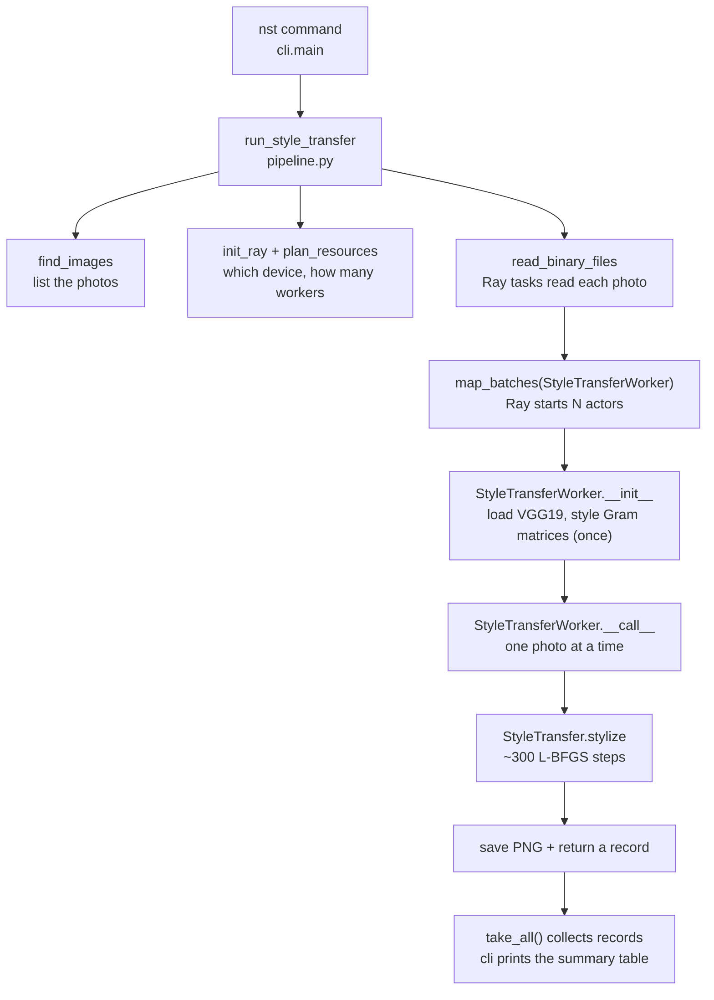

# How it works

A guided tour of this project for readers who are new to neural style transfer, PyTorch or Ray.
It explains the ideas in plain language, then follows one run of the program from the command
line to the saved image, with a link to the code for every step.

If you only want to run it, the [README](../README.md) is enough.

**Contents**

1. [What the program does](#1-what-the-program-does)
2. [Neural style transfer in plain language](#2-neural-style-transfer-in-plain-language)
3. [The PyTorch pieces](#3-the-pytorch-pieces)
4. [The Ray pieces](#4-the-ray-pieces)
5. [Walkthrough: one run, step by step](#5-walkthrough-one-run-step-by-step)
6. [The settings you can change](#6-the-settings-you-can-change)
7. [Glossary](#7-glossary)
8. [Further reading](#8-further-reading)

---

## 1. What the program does

You give it one **style image** (for example Van Gogh's *The Starry Night*) and any number of
**content images** (photos). For each photo it produces a new image with the photo's layout
and the painting's colours and brush strokes:


Each photo takes about 4 to 60 seconds of computation, depending on the hardware. To process many
photos quickly, the program spreads them across several **workers**, and Ray runs those workers
on the GPUs and machines available.

---

## 2. Neural style transfer in plain language

### Measuring "content" and "style" with a pretrained network

The method comes from Gatys, Ecker and Bethge,
[*Image Style Transfer Using Convolutional Neural Networks*](https://openaccess.thecvf.com/content_cvpr_2016/html/Gatys_Image_Style_Transfer_CVPR_2016_paper.html)
(2016). It relies on **VGG19**, a neural network trained on millions of photos to recognise 1,000
kinds of objects. To do that, VGG19 learned a stack of filters: early layers react to edges,
colours and small textures, and deeper layers react to larger shapes and object parts.

We never use VGG19 to classify anything. We use its filters as a ruler for measuring images:

- **Content** is read from a deep layer. Its activations say which large patterns are in the
  picture and roughly where: "a house with a roof here and a fence along the bottom".
- **Style** is read from five layers, from shallow to deep, and summarised as **Gram matrices**.
  A Gram matrix records which filters fire *together* (for example, "swirly strokes tend to appear
  with dark blue") and throws away *where* they fire. What remains is texture: colours,
  brush strokes and patterns at every scale, with no layout.

In code: [`model.py`](../src/neural_style_transfer/model.py) (`VGGFeatures` and `gram_matrix`).

### Optimising the image, not the network

Most deep learning trains a network's weights. Here the network stays **frozen**, and the
**pixels of the output image** are what get optimised:

1. Measure the painting's Gram matrices once. These are the **style targets**.
2. Measure the photo's deep activations once. This is the **content target**.
3. Start the output as a copy of the photo.
4. Measure the output and compute a **loss**, a single number that is large when the output
   is far from the targets:
   `loss = content_weight × (content difference) + style_weight × (style difference)`
5. Use **backpropagation** to work out, for every pixel, which way it should change to lower
   the loss. Let the **optimiser** (L-BFGS) take a step.
6. Repeat about 300 times.

The result keeps the photo's structure, because the content loss holds it in place, while
taking on the painting's textures, because the style loss pulls them in.

In code: [`transfer.py`](../src/neural_style_transfer/transfer.py) (`StyleTransfer.stylize`).

### Why it is slow, and why that makes it a good fit for Ray

Each of the ~300 steps runs the image through VGG19 forwards and backwards, so one image is a
lot of GPU work: about 4 seconds on an NVIDIA L40S and about 60 seconds on a laptop CPU. But no image
depends on any other. That is called **embarrassingly parallel**: with 4 GPUs you can stylise
4 images at once, and nothing needs to be coordinated between them. Ray does the distributing.

---

## 3. The PyTorch pieces

| Concept | What it is | Where it appears |
|---|---|---|
| **Tensor** | PyTorch's array type, like a NumPy array that can live on a GPU. An image here is a tensor of shape `[1, 3, H, W]`: one image, 3 colour channels, height, width. | `load_image`, `to_pil` in `transfer.py` |
| **Device** | Where tensors live and computations run: `cuda` (NVIDIA GPU), `mps` (Apple GPU) or `cpu`. Model and data must be on the same device. | [`device.py`](../src/neural_style_transfer/device.py) |
| **`nn.Module`** | PyTorch's building block for networks. `VGGFeatures` wraps VGG19 and returns the activations of chosen layers. | `VGGFeatures` in `model.py` |
| **Autograd / `backward()`** | PyTorch records every operation on tensors that require gradients. `loss.backward()` walks that record backwards and fills `image.grad` with how each pixel affects the loss. | `closure` inside `stylize` |
| **Optimiser** | Uses gradients to update parameters. Here the "parameters" are the image pixels, and the optimiser is L-BFGS, which estimates the curvature of the loss and suits this smooth problem. | `torch.optim.LBFGS` in `stylize` |
| **`torch.no_grad()`** | Turns off gradient recording where we only need values, such as the fixed targets. This saves memory and time. | `StyleTransfer.__init__`, `stylize` |

---

## 4. The Ray pieces

| Concept | What it is | Where it appears |
|---|---|---|
| **Cluster** | The machines Ray can use. On a laptop it is just the laptop; on Anyscale or a cloud it can be many GPU machines. | `init_ray` in [`pipeline.py`](../src/neural_style_transfer/pipeline.py) |
| **Task** | A function Ray runs somewhere in the cluster. Stateless: anything it needs is loaded again on every call. | `read_binary_files` uses tasks to read files |
| **Actor** | An object that lives in its own process. Its `__init__` runs once and its state stays in memory, so the 548 MB model is loaded once and then reused for every image. | `StyleTransferWorker` in `pipeline.py` |
| **Resources** | Each task or actor declares what it needs (`num_cpus`, `num_gpus`, or custom resources such as `{"mps": 1}`), and Ray only places it where those are free. `num_gpus=0.5` lets two actors share one GPU. | `plan_resources`, `ResourcePlan` in `pipeline.py` |
| **Ray Data** | A library that streams a dataset through tasks and actors. `map_batches(SomeClass, concurrency=N)` starts N actors of `SomeClass` and feeds them batches of rows. | `run_style_transfer` in `pipeline.py` |

**Why actors and not tasks?** Loading VGG19 and moving it to the GPU takes seconds. A task would
repeat that for every image. An actor pays it once and then processes images back to back.

**Why the Apple GPU needs special handling:** Ray counts NVIDIA GPUs automatically but not Apple
GPUs. The program registers the Apple GPU as a custom resource called `mps`, so Ray still knows
it has exactly one to share out.

---

## 5. Walkthrough: one run, step by step

Command:

```bash
nst --style samples/style/starry_night.jpg samples/content -o outputs
```



| Step | What happens | Code |
|---|---|---|
| 1 | The `nst` command parses its options into a `StyleConfig` (size, steps, weights) and calls `run_style_transfer`. | `main` in [`cli.py`](../src/neural_style_transfer/cli.py) |
| 2 | Directories are expanded into image files, and inputs that would produce the same output name are rejected. | `find_images`, `run_style_transfer` in `pipeline.py` |
| 3 | Ray starts. On a Mac the Apple GPU is registered as the resource `mps`. | `init_ray` |
| 4 | The program asks Ray what the cluster has (CPUs, GPUs, `mps`) and picks the device. | `detect_cluster_device` |
| 5 | It decides how many workers to start and what each reserves, such as one GPU each. Requests that cannot fit are rejected immediately instead of waiting forever. | `plan_resources` |
| 6 | Ray Data reads each photo as raw bytes, one file per block, using lightweight CPU tasks. | `ray.data.read_binary_files` |
| 7 | `map_batches` starts the pool of `StyleTransferWorker` actors. Each actor is limited to one image at a time, so a fast-starting actor cannot grab every image while the others sit idle. | `run_style_transfer` |
| 8 | Each actor's constructor loads VGG19 onto its device and computes the painting's Gram matrices. This happens once per actor. | `StyleTransferWorker.__init__` → `StyleTransfer.__init__` |
| 9 | Ray hands each actor a photo. The actor runs the optimisation from section 2. | `StyleTransferWorker.__call__` → `StyleTransfer.stylize` |
| 10 | Inside `stylize`, L-BFGS repeatedly calls `closure`, which computes the content and style losses, calls `backward()`, and returns the loss. | `closure` in `transfer.py` |
| 11 | The finished image is saved as `outputs/<photo name>_stylized.png`. If anything fails, the error goes into that image's record and the other images carry on. | `StyleTransferWorker.__call__` |
| 12 | `take_all()` runs the pipeline to completion and brings every record back. The CLI prints one line per image and the overall images per minute. | `run_style_transfer`, `main` |

The same code runs on a laptop and on a multi-GPU cluster. Only the resources Ray finds differ.

---

## 6. The settings you can change

| Setting | Effect of raising it | Effect of lowering it |
|---|---|---|
| `--size` | Sharper output, but slower: doubling it costs roughly 3–4x the time and more GPU memory. Very large sizes also make brush strokes look smaller. | Faster, blurrier |
| `--steps` | More converged, more stylised (diminishing returns past ~300) | Faster, closer to the original photo |
| `--style-weight` | Bolder painting effect (try `1e7`) | Closer to the photo (try `1e5`) |
| `--workers` | More images in parallel, up to the number of GPUs (or GPU shares) | Fewer processes, less memory |
| `--accelerator-fraction` | – | Below 1.0, workers share a GPU. That helped on an Apple GPU but hurt on NVIDIA GPUs in [the benchmarks](../README.md#benchmarks), so measure before using it. |

---

## 7. Glossary

- **Activation**: the output of one layer of a neural network for a given input.
- **Backpropagation**: the method for computing how every input value (here, every pixel)
  affects the loss. PyTorch does it automatically with `loss.backward()`.
- **Embarrassingly parallel**: work that splits into independent pieces needing no
  communication, like stylising separate photos.
- **Fractional GPU**: letting several Ray workers share one GPU by each reserving part of it,
  e.g. `num_gpus=0.5`. This is only a scheduling rule: the GPU's memory and compute are not
  actually partitioned.
- **Gradient**: for each pixel, the direction and amount to change it to reduce the loss.
- **Gram matrix**: a `C × C` table of how strongly each pair of a layer's `C` filters fire together.
  It captures texture and throws away position.
- **ImageNet**: the large labelled photo collection VGG19 was trained on.
- **L-BFGS**: an optimisation algorithm that uses recent gradients to estimate curvature and take
  well-sized steps. It works well for smooth problems like this one.
- **Loss**: a single number measuring how far the current output is from what we want.
- **MPS (Apple)**: Metal Performance Shaders, PyTorch's backend for Apple Silicon GPUs. (NVIDIA
  also has an unrelated "MPS", the Multi-Process Service.)
- **Ray actor / task**: a long-lived stateful worker process / a stateless remote function call.
- **Tensor**: a multi-dimensional array, PyTorch's basic data type.
- **VGG19**: a 19-layer convolutional neural network from Oxford's Visual Geometry Group (2014).

---

## 8. Further reading

- Gatys et al., [*Image Style Transfer Using Convolutional Neural Networks*](https://openaccess.thecvf.com/content_cvpr_2016/html/Gatys_Image_Style_Transfer_CVPR_2016_paper.html), CVPR 2016: the method used here.
- PyTorch tutorial: [Neural Transfer Using PyTorch](https://pytorch.org/tutorials/advanced/neural_style_tutorial.html).
- Ray documentation: [Ray Core key concepts](https://docs.ray.io/en/latest/ray-core/key-concepts.html)
  and [Ray Data: stateful transforms with actors](https://docs.ray.io/en/latest/data/transforming-data.html#stateful-transforms).
- Johnson et al., [*Perceptual Losses for Real-Time Style Transfer*](https://arxiv.org/abs/1603.08155), 2016:
  the faster, feed-forward alternative to this method.
